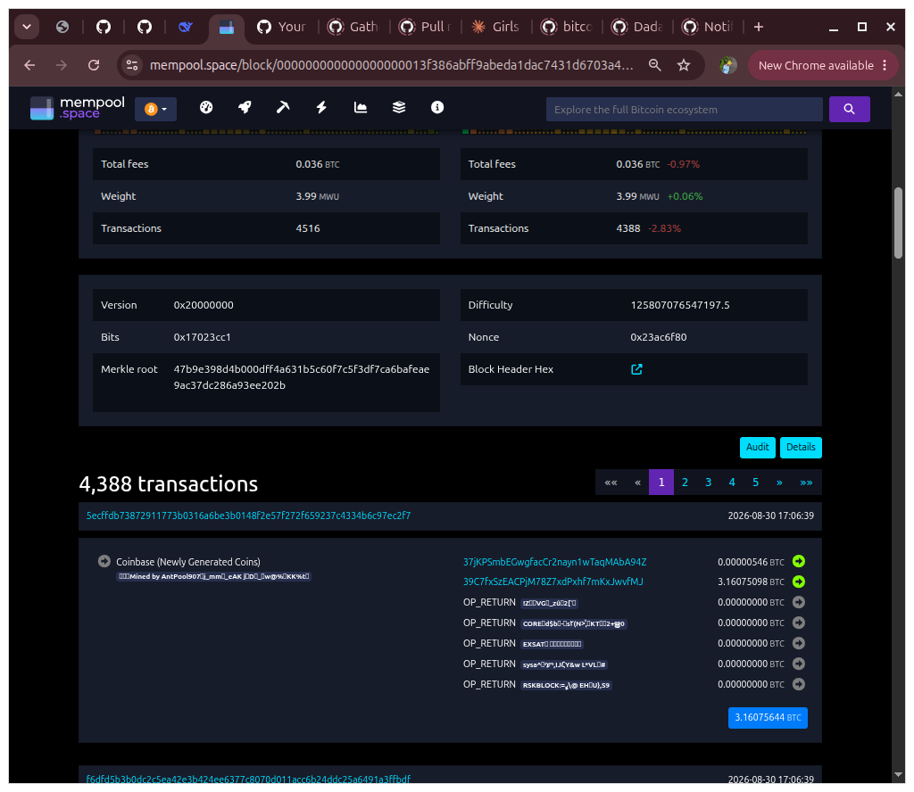

# Assignment 6: Bitcoin Block and Merkle Tree Assignment

## Task 1: Block Inspection

### Block Details

| Field | Value |
|-------|-------|
| **Block Height** | 964736 |
| **Block Hash** | 000000000000000000013f386abff9abeda1dac7431d6703a4d14d3ac9e4bd76 |
| **Previous Block Hash** | 964735 |
| **Merkle Root** | 47b9e398d4b000dff4a631b5c60f7c5f3df7ca6bafeae9ac37dc286a93ee202b |
| **Number of Transactions** | 4388 |
| **Timestamp** | 2026-08-30 17:06:39 |

---

### Explorer Used

- **Explorer:** mempool.space
- **Block URL:** https://mempool.space/block/000000000000000000013f386abff9abeda1dac7431d6703a4d14d3ac9e4bd76

---

### Observations

- The block contains 4388 transactions.
- The Merkle root is a cryptographic summary of all transactions in the block.
- Any change to a transaction would change the Merkle root, ensuring data integrity.
- The previous block hash links this block to the one before it, forming the blockchain.

##Screenshot
